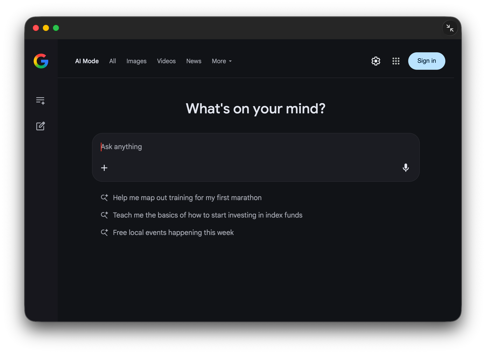

# Google AI Desktop for macOS - inspired from [gemini-desktop-mac](https://github.com/alexcding/gemini-desktop-mac)

An **unofficial macOS desktop wrapper** for Google AI, built as a lightweight desktop app that loads the official Google AI website.




> **Disclaimer:**
> This project is **not affiliated with, endorsed by, or sponsored by Google**.
> "Google AI" and related marks are trademarks of **Google LLC**.
> This app does not modify, scrape, or redistribute Google AI content — it simply loads the official website.

---

## Features

### Floating Chat Bar
- **Quick Access Panel** - A floating window that stays on top of all apps

### Global Keyboard Shortcut
- **Toggle Chat Bar** - Set your own shortcut in Settings to instantly show/hide the chat bar from any app
- Configurable via visual keyboard recorder in preferences

### Other Features
- Native macOS desktop experience
- Lightweight WebView wrapper
- Adjustable text size (80%-120%)
- Camera & microphone support for Google AI features
- Uses the official Google AI web interface
- No tracking, no data collection
- Open source

---

## What This App Is (and Isn't)

**This app is:**
- A thin desktop wrapper around `https://google.com/ai`
- A convenience app for macOS users

**This app is NOT:**
- An official Google AI client
- A replacement for Google's website
- A modified or enhanced version of Google AI
- A Google-authored product

All functionality is provided entirely by the Google AI web app itself.

---

## Login & Security Notes

- Authentication is handled by Google on their website
- This app does **not** intercept credentials
- No user data is stored or transmitted by this app

> Note: Google may restrict or change login behavior for embedded browsers at any time.

---

## System Requirements

- **macOS 14.0 (Sonoma)** or later

---

## Installation

### Download
- Grab the latest release from the **Releases** page
  *(or build from source below)*

### Build from Source
```bash
git clone https://github.com/rasyidridho/google-ai-mac-app.git
cd google-ai-mac-app
open GoogleAIMac.xcodeproj
Build and run in Xcode
```
